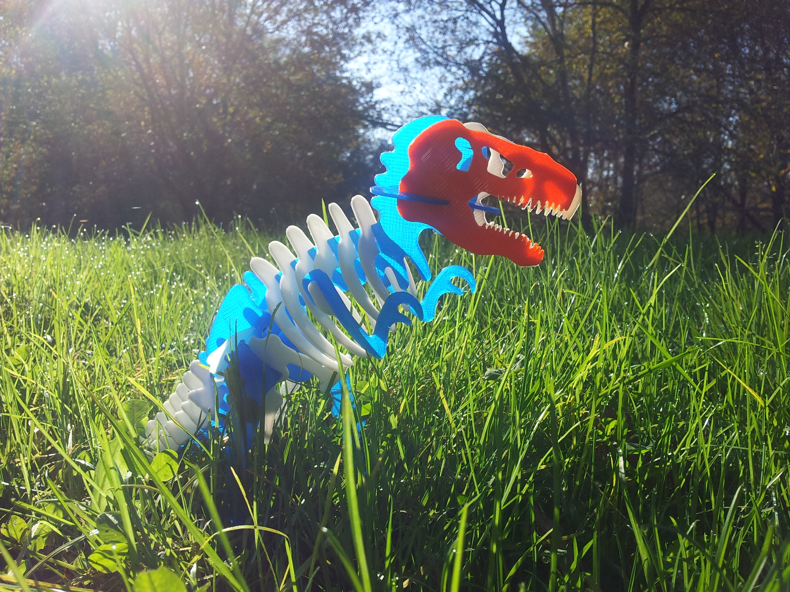

# Tyrannosaurus

3D printed press fit mounting of a T-Rex skull. 
Derived from [kaptaink_sg](http://www.instructables.com/member/kaptaink_cg) [Instructables about a 6' tall wooden T-Rex](http://www.instructables.com/id/Build-a-6-0-tall-Wooden-T-Rex-Model).

# Slice manual scale settings
07/12/2014 STL file releases need to be scaled before print.
Scale settings I used for my first print :
X & Y scale 0.5
Z height scale at 1.5 mm

# License

# Improvement ideas
Redesign from the ground up to change license to CC BY-SA. I don't know if CC BY-NC-SA from Instructables apply to the Instructables article and T-Rex 2D scheme or both. 

Redesign with [FlatFab](http://flatfab.com) for exemple.

Parametric modelisation use in order to print it thicker.

Give more 3D volume to pieces.

Make it bigger with more pieces.

Mechanize it as a [Poppy creature](https://www.poppy-project.org)

